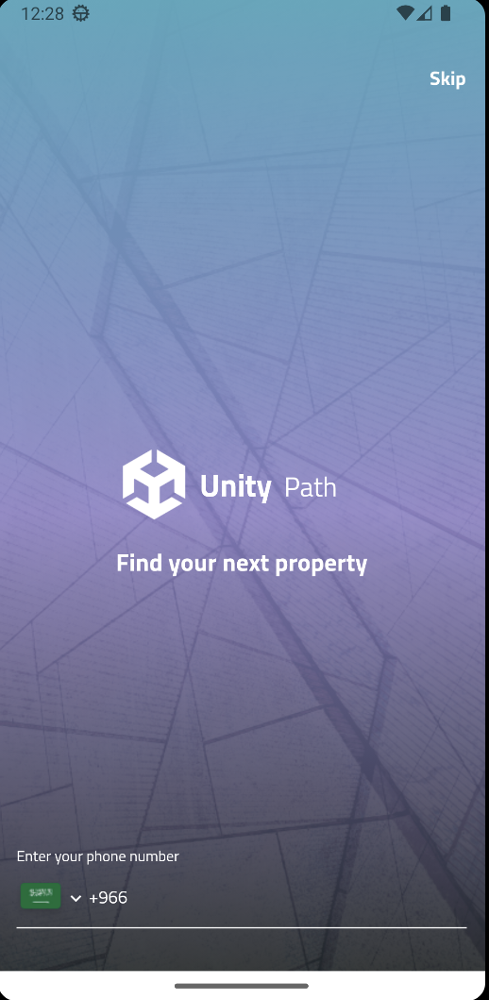
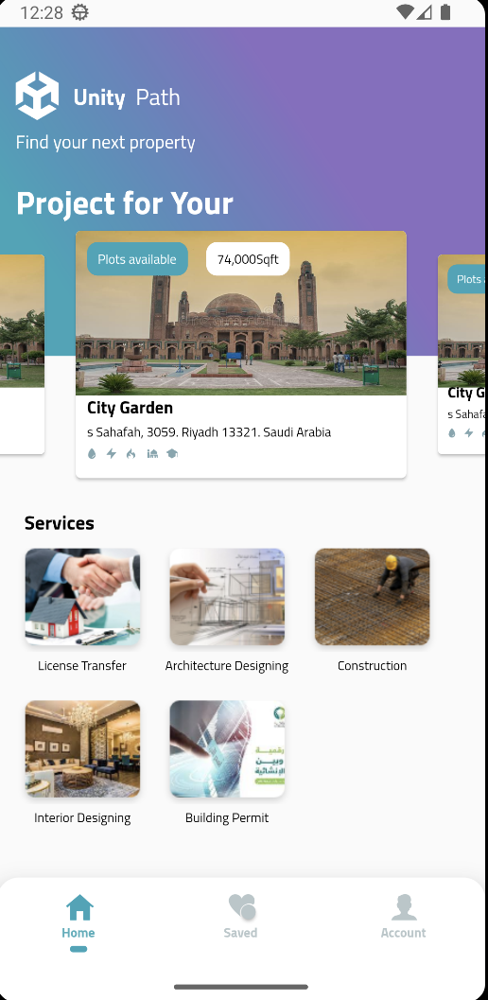
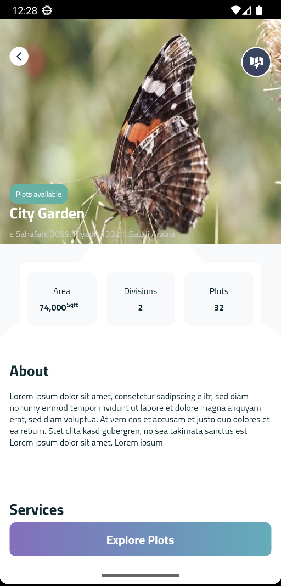
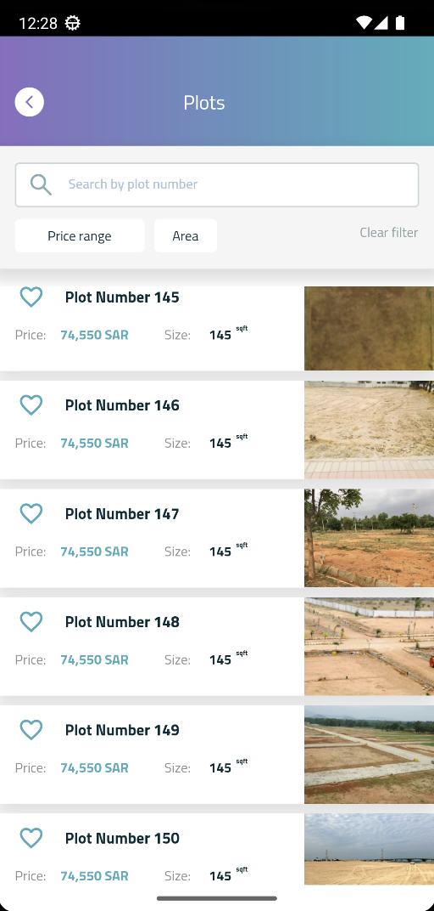
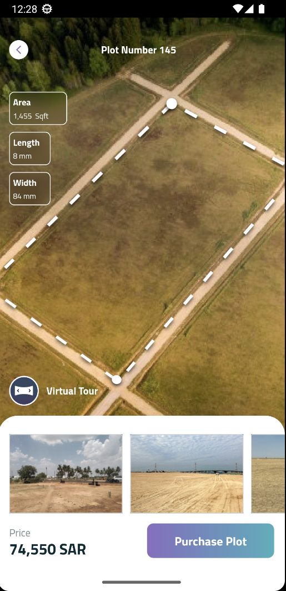
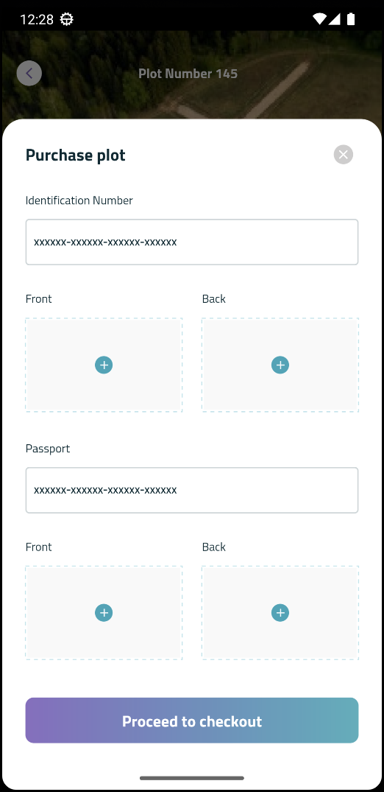
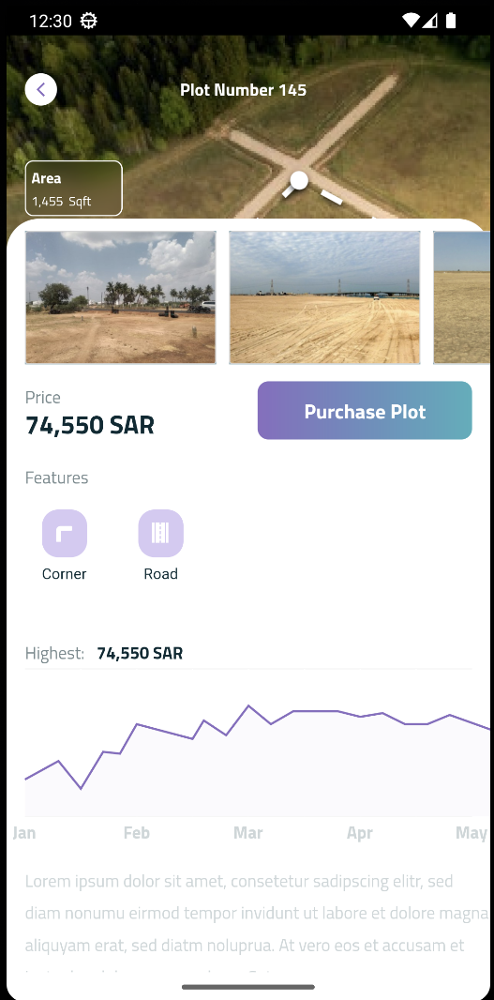
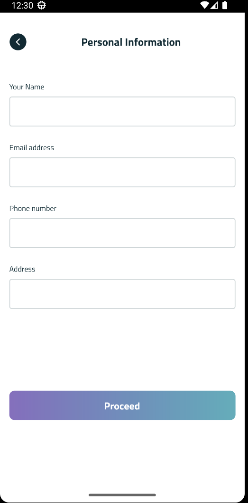
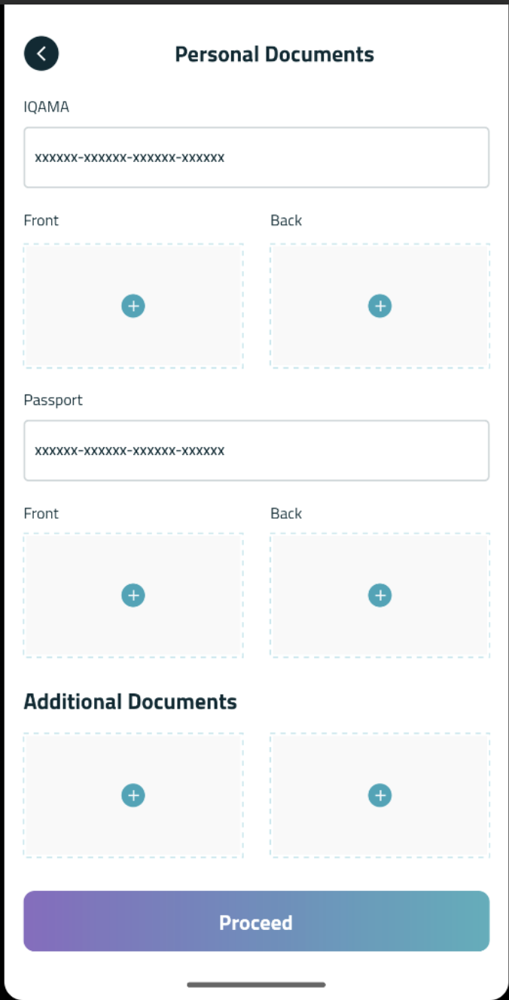
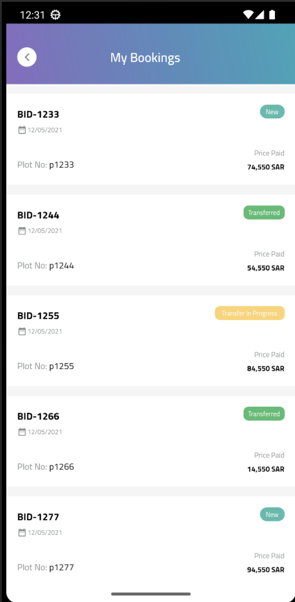

# UNITY-PATH

 

INTRODUCTION

The Unity Path application is a crowdfunding platform for real-estate businesses. The app allows investors to browse and invest in various real-estate projects. The app provides a user-friendly interface that makes it easy for investors to view project details, assess risks and returns, and make investments. Investors can also track their investments and receive regular updates on the project's progress. The Unity Path application is a valuable tool for real-estate developers and investors alike, enabling them to raise capital for real-estate projects and diversify their investment portfolios. With its intuitive interface and powerful features, the Unity Path application is a great way for investors to participate in the real-estate market and for developers to access funding for their projects.

SYSTEM FEATURES

The system has Admin & Client Side

Admin Side(Web App)

1. Manage Plots
2. Manage Bookings
3. Manage Contents
4. Manage Users
5. View Analytics
6. Reports

Client Side (Mobile Side)

1. Browse Plots
2. View AR View Of Plots
3. Invest In Plots
4. View All Bookings
5. Pay Via App
6. Indoor Navigation

TECNICALITIES/TOOLS USED
1. Flutter
2. Oracle Database
3. Augmented Reality
4. Mapbox Integration
5. Local Authentication
6. OTP Platform Integrations
7. REST APIs
8. Laravel(php) Backend

CLIENT SIDE SCREENSHOT

           

INSTALLATION GUIDE

The Application is under-developed thats why its not uploaded on the Application stores. APK link is attached. The application can be installed by simply click on APK and follow the steps.

APK Link: https://drive.google.com/file/d/1E2QB5cvChqSwOjk96u6tmvF-RiK4lvT2/view?usp=sharing

                                                              THANKS

